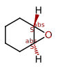
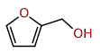

## 10_ex2

| Exercise | Correction |
|----------|------------|
| 10_Aufgabe_3 |  |

## 20_ex3

| Exercise | Correction |
|----------|------------|
| 10_Aufgabe_2 |  |
| 20_Aufgabe_3 |  |

## 30_ex4

| Exercise | Correction |
|----------|------------|
| 10_Aufgabe_2 |  |
| 20_Aufgabe_3 |  |

## 40_ex5

| Exercise | Correction |
|----------|------------|
| 10_Aufgabe_2 |  |
| 20_Aufgabe_3 |  |
| 30_Aufgabe_4 |  |

## 41_ex5-examples

| Exercise | Correction |
|----------|------------|
| 10_Aufgabe_1a_-_o-Anisaldehyd |  |
| 20_Aufgabe_1b_-_Cyclohexenoxid |  |
| 30_Aufgabe_1c_-_2-Brombutan |  |
| 40_Aufgabe_1d_-_Valinol |  |
| 50_Aufgabe_1e_-_Citronensaeure |  |
| 60_Aufgabe_1f_-_Biphenyl |  |

## 50_ex6

| Exercise | Correction |
|----------|------------|
| 10_Aufgabe_1 |  |
| 20_Aufgabe_2 |  |
| 25_Aufgabe_2_alt |  |

## 60_ex7

| Exercise | Correction |
|----------|------------|
| 10_Aufgabe_1 |  |
| 20_Aufgabe_2 |  |

## 99_misc

| Exercise | Correction |
|----------|------------|
| 106-89-8 |  |